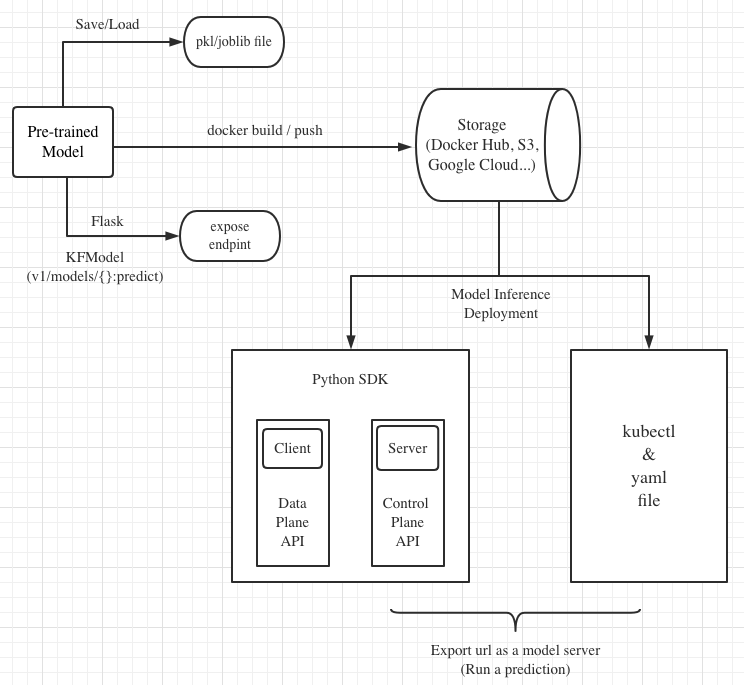
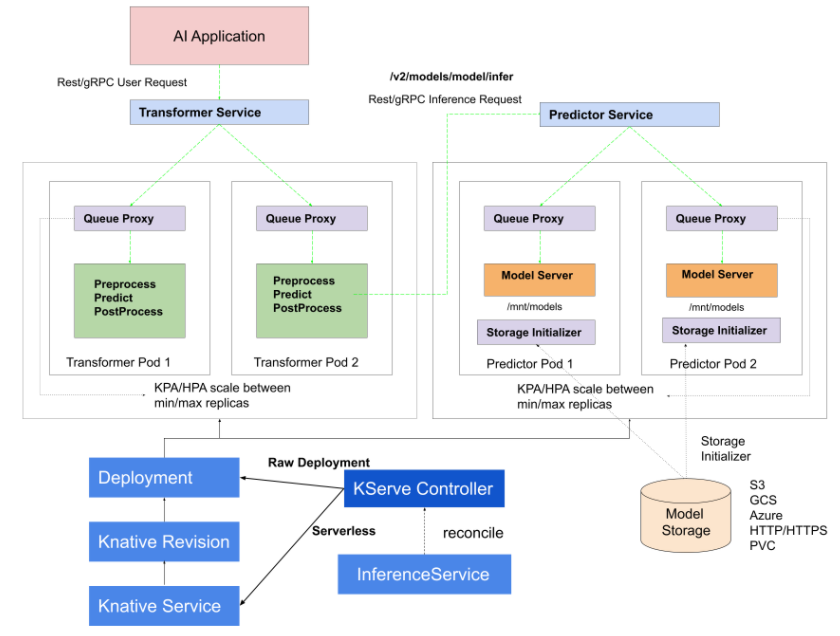

Deploy
======

Pipeline
--------

.. seealso::

   `Link to the KFServing summary notes <https://dashing-axolotl-95d.notion.site/KFServing-98ca85ba483841cc84697512fffef916>`_

Model Serving Basics
--------------------

Background
++++++++++

Most of the attention paid to machine learning has been devoted to algorithm development.
However, models are not created for the sake of their creation, they are created
to be put into production. Usually when people talk about taking a model “to
production,” they mean performing inference. A complete inference solution seeks to provide serving, 
monitoring, and updating functionality. This chapter will focus on the model serving, there are advantages 
about model serving as following,

* Helping to standardize model serving across orgs with unified data plane and pre-built model servers
* A single way to deploy, monitor inference services/server, and scale inference workload
* Dramatically shortening time for data scientists to deploy models to production

Overview
++++++++

Machine learning model inference is the process of taking an existing trained model and 
using new data as input to produce model output such as a classification (e.g., “label”), 
or a continuous real-valued number from a regression model (e.g., “house price”). 
The Figure1 shows the architecture of the model inference, 

   Figure 1 - The Workflow of Model Serving.

KServe Basics
-------------

Overview
++++++++

KServe is a standard Model Inference Platform on Kubernetes, built for highly scalable use cases. KServe provides a Kubernetes Custom Resource Definition for 
serving machine learning (ML) models on arbitrary frameworks. It encapsulates the complexity of autoscaling, networking, health checking, 
and server configuration to bring cutting edge serving features like GPU Autoscaling, Scale to Zero, and Canary Rollouts to your ML deployments.

.. figure:: ./figs/kserve-overview.png
   :width: 1024
   :scale: 60%
   :align: center

   Figure 2 - The Overview of Kserve.

Architecture
++++++++++++

Control Plane
^^^^^^^^^^^^^

Responsible for reconciling the InferenceService custom resources. It creates the Knative serverless deployment for predictor, transformer, explainer to 
enable autoscaling based on incoming request workload including scaling down to zero when no traffic is received.

   Figure 3 - The Control Plane of Kserve.

Data Plane
^^^^^^^^^^

The Kserve data plane architecture is described as figure 4. 

.. figure:: ./figs/data-plane.png
   :width: 800
   :scale: 70%
   :align: center

   Figure 4 - The Data Plane of Kserve.

* Endpoint: InferenceServers are divided into two endpoints: "default" and "canary". The endpoints allow users to safely make changes using the Pinned and Canary rollout strategies

* Component: Each endpoint is composed of multiple components: "predictor", "explainer", and "transformer". The only required component is the predictor, which is the core of the system

* Predictor: The predictor is the workhorse of the InferenceService. It is simply a model and a model server that makes it available at a network endpoint

* Explainer: The explainer enables an optional alternate data plane that provides model explanations in addition to predictions. KFServing provides out-of-the-box explainers like Alibi.

* Transformer: The transformer enables users to define a pre and post processing step before the prediction and explanation workflows. KFServing provides out-of-the-box transformers like Feast

KServe's Services and Features
++++++++++++++++++++++++++++++

* Single Model Serving
* Multi Model Serving
* Deploy InferenceService with Transformers
* Deploy InferenceService with Explainer
* Deploy InferenceService with storage
* Model Monitoring
* Autoscaling
* Request Batching
* Payload Logging
* Kafka

Using KServe
------------

Environments
++++++++++++

.. csv-table:: Table 1: Environment settings
   :header: "Cluster", "Kubeflow", "KFServing", "Demo Link" 
   :widths: 15, 10, 10, 15

   "AWS EKS with kubernetes 1.8", kubeflow 1.2, KFserving v0.4.1, `Demo Link 1 <http://549e5b50-istiosystem-istio-2af2-834352904.us-west-1.elb.amazonaws.com/dex/auth/local?req=itknagh4dq35xqbe5egxbsmid>`_ 
   "OpenShift with kubernetes 1.8", kubeflow 1.4, KFserving v0.6.0, `Demo Link 2 <https://console-openshift-console.apps.ocp4-cluster-001.liuqi.io/k8s/cluster/projects>`_
   "vSphere TKG with kubernetes 1.8", kubeflow 1.4, KFserving v0.6.0, `Demo Link 3 <http://127.0.0.1:8080/?ns=kubeflow-user-example-com>`_

Setup and Applications on vSphere TKG
+++++++++++++++++++++++++++++++++++++

Login vSphere TKG
^^^^^^^^^^^^^^^^^

.. code-block:: bash
   :linenos:

   # login your vSphere TKG, 密码 Admin!23
   $ kubectl vsphere login --server=10.117.233.1 --vsphere-username administrator@vsphere.local --insecure-skip-tls-verify --tanzu-kubernetes-cluster-namespace=liuqi --tanzu-kubernetes-cluster-name=tkgs-cluster-31

   # export your vSphere TKG port, and login kubeflow ui with username (user@example.com) and password (12341234)
   $ kubectl port-forward svc/istio-ingressgateway -n istio-system 8080:80

Applications on vSphere TKG
^^^^^^^^^^^^^^^^^^^^^^^^^^^

* Single Model InferenceService:

.. code-block:: bash
   :linenos:

   # Deploy a model inferenceservice [demo: <sert a link>]
   kubectl apply -f sklearn.yaml -n kubeflow-user-example-com
   # Output
   $ inferenceservice.serving.kserve.io/sklearn-iris created
   
   # Run a prediction with curl
   MODEL_NAME=sklearn-iris
   INPUT_PATH=@./iris-input.json
   SESSION=[login your kubeflow ui find the request header Cookie]
   SERVICE_HOSTNAME=$(kubectl get -n kfserving-samples inferenceservice ${MODEL_NAME} -o jsonpath='{.status.url}' | cut -d "/" -f 3)
   curl -v -H "Host: ${SERVICE_HOSTNAME}" -H "Cookie: authservice_session=${SESSION}" http://127.0.0.1:8080/v1/models/${MODEL_NAME}:predict -d ${INPUT_PATH} 
   # Output
   *   Trying 127.0.0.1:8080...
   * TCP_NODELAY set
   * Connected to 127.0.0.1 (127.0.0.1) port 8080 (#0)
   > POST /v1/models/sklearn-iris:predict HTTP/1.1
   > Host: sklearn-iris.kubeflow-user-example-com.example.com
   > User-Agent: curl/7.67.0
   > Accept: */*
   > Cookie: authservice_session=MTYzNzc0NjkzOXxOd3dBTkVveU16Y3pXa0l6UkVKRVVGSkRWMVpSU2xveVIxQlZTRk0xUzBKWFFraEhNa2hFVkZaTVNGSlJURVJSVDA1TFJVcFFWVkU9fEFCFhhb2MHqcysV7xOCPIYkbgvA41mGoWRhb8e4waLa
   > Content-Length: 76
   > Content-Type: application/x-www-form-urlencoded
   >
   * upload completely sent off: 76 out of 76 bytes
   * Mark bundle as not supporting multiuse
   < HTTP/1.1 200 OK
   < content-length: 23
   < content-type: application/json; charset=UTF-8
   < date: Wed, 24 Nov 2021 17:29:14 GMT
   < server: istio-envoy
   < x-envoy-upstream-service-time: 30
   <
   * Connection #0 to host 127.0.0.1 left intact
   {"predictions": [1, 1]}   

There are the supported ML frameworks and fuctions in KServe: 

.. csv-table:: Table 2: Out-of-the-box Predictor
   :header: "Model Name", "Verification", "Performance"
   :widths: 15, 15, 20

   "Sklearn", "Pass", "xxx"
   "Tensorflow", "Pass", "xxx"
   "PyTorch", "Pass", "xxx"
   "Paddle", "Pass", "xxx"
   "XGBoost", "Pass", "xxx"
   "LightGBM", "Pass", "xxx"
   "Rollout", "Pass", "xxx"
   "Transformer", "Not test", "xxx"
   "and so on", "...", "..."

* Custom Model InferenceService: 

.. code-block:: bash
   :linenos:

   # Run the training models on your local machine and server with kfserving.KFModel 
   #[demo: insert a link]   
   # Build a model server with docker 
   docker build -t {username}/kfserving-custom-model ./model-server
   # Push the container to docker registry
   docker push {username}/kfserving-custom-model
   
   # Create the InferenceService with yaml file 
   kubectl apply -f custom.yaml
   # Output
   $ inferenceservice.serving.kserve.io/sklearn-iris created
   # Run a prediction

* Using KServe Python SDK: XXX

* Deploy InferenceService with Cloud/PVC storage: XXX

Setup and Applications on OpenShift
+++++++++++++++++++++++++++++++++++

XXX

Advanced KServe
---------------

Kserve Python SDK
+++++++++++++++++

#. Overview

   Python SDK for KFServing Server and Client

   .. code-block:: bash
      :linenos:

      # Installation
      pip install kfserving

      # Install via Setuptools
      sudo python setup.py install    # for all user
      or
      python setup.py install --user

#. KFServing Server

   KFServing's python server libraries implement a standardized KFServing library that is extended by model serving frameworks such as Scikit Learn, XGBoost and PyTorch. It encapsulates data plane API definitions and storage retrieval for models

#. KFServing Client

   KFServing's python client interacts with KFServing control plane APIs for executing operations on a remote KFServing cluster, such as creating, patching and deleting of a InferenceService instance

   API Groups:

   * KnativeAddressable
   * KnativeCondition
   * KnativeURL
   * V1beta1Batcher
   * V1beta1ComponentExtensionSpec
   * V1beta1CustomExplainer
   * V1beta1InferenceService
   * V1beta1InferenceServiceList
   * and etc...
