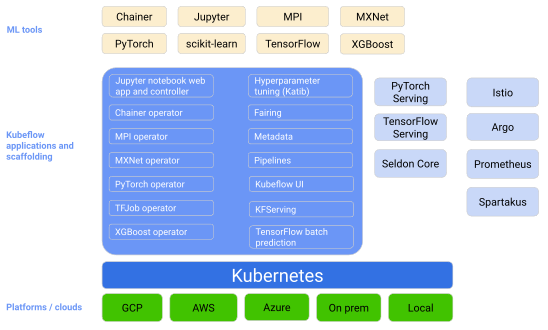
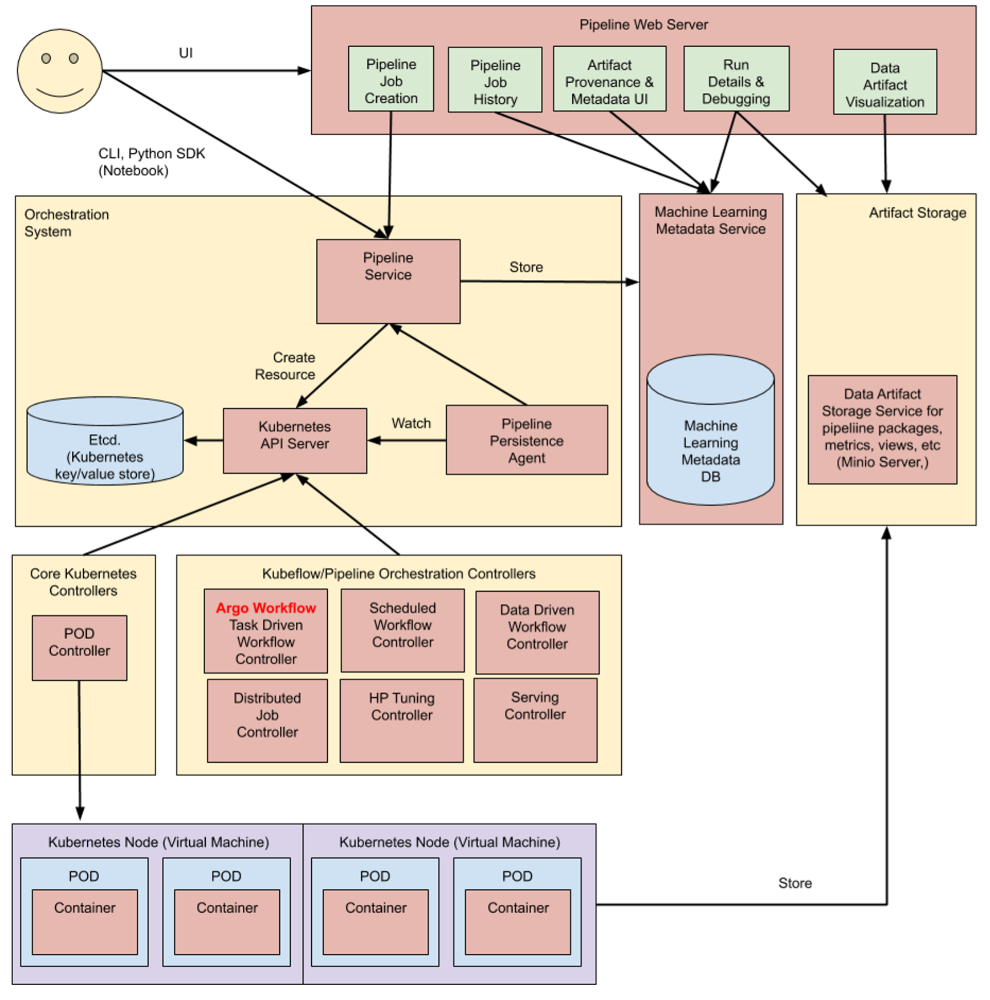

Kubeflow
========
Introduction

Conceputal overview

   Figure 1 - The kubeflow Conceputal overview.

Components

   Figure 2 - The kubeflow architecural overview.

* Dashboard
* Notebooks
* Pipelines
* Build
  - Data Ingestion, Model Training, Model Testing, Model Packaging, Model Registering
* Deploy
  Application Testing, Production Release
* Monitor
  Monitor, Analyze, Govern
* Model Serving
  KFServing
  PyTroch Serving
  TF Serving
  Seldon Core
* Hyperparmeter tuning
* Katib
* Training Operations
* Job Scheduling
* Multi-Tenancy
