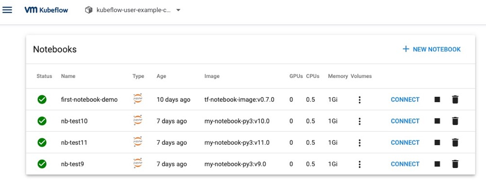
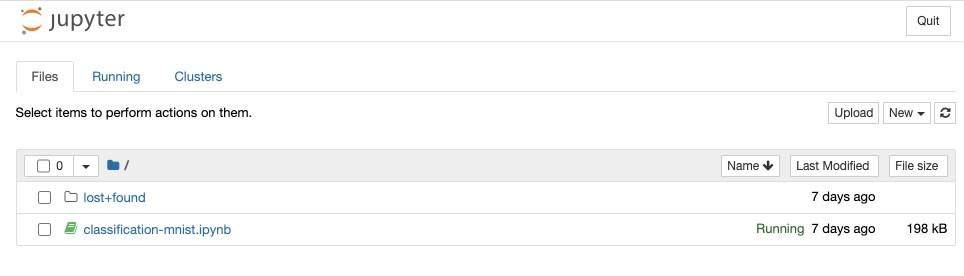
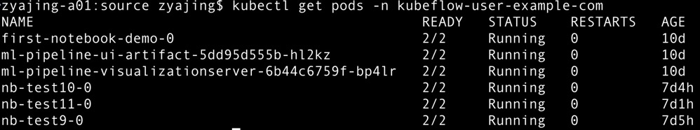

Model
=====

Notebook
--------

Notebook provides a way to run Machine Learning applications in a kubernetes cluster. This method is based on a web development environment. It provides an interface for creating Notebook Server in the web, and runs the corresponding container images in Pods. Notebook contains some key features, as follows:

- Users can directly create containers in the kubernetes cluster
- Admins can use custom images configured by themselves
- The running of the container in Notebook can create its own corresponding PVC or not.
- Access control is managed by Kubeflow's RBAC, making it easier to share notebooks throughout the organization.

Essentially, Notebook Server is a Jupyter lab container, or a service for installing Jupyter in the container. Notebook supports the entire calculation process: developing, recording and executing code, and communicating the results. The service name of each Notebook Server cannot be repeated by default. You can use an existing image or a custom image. Configure resources according to the resource requirements of workload in the image, such as CPU, GPU memory, and memory size.

To access JupyterHub on the Kubeflow main page, you need to click the Notebook button. When you switch to the Notebook interface, you can choose to connect to an existing Notebook server or create a new Notebook server. If you create a new notebook, you need to specify the notebook name and namespace, and then select the image, which can be docker hub image, googleCloud image or custom image, etc. Also you need to configure the resources required for the workload --- GPU/CPU/memory, workspace, data volumes, custom configuration, and so on.
There are some created Notebook server as follow in the web page: 

   Figure 1 - The Notebook in kubeflow.

When the Notebook server has created successfully, you might click connect button and enter JupyterHub web page as follow, then you could edit code easily. 

   Figure 2 - Jupyterhub in Notebook.

The operations performed by the data scientist on the Notebook server interface can find the corresponding Kubernetes resources in the namespace operated by the data scientist, and can create and manage Kubernetes resources through the ``kubectl`` command. Jupyter notebook pod runs under the special service account default-editor and has namespace-scoped permissions on the following Kubernetes resources:

- Pods
- Deployments
- Services
- Jobs

   Figure 3 - pods showing in Notebook.

Metadata Artifacts
------------------

Machine learning typically involves dealing with a large amount of raw and intermediate transformed data where the ultimate goal is creating and deploying the model. In order to understand our model, it is necessary to be able to explore datasets used for its creation and transformations. The collection of these datasets and the transformation applied to them is called the metadata of our model.

Model metadata is critical for reproducibility in machine learning. Capturing the metadata allows us to understand variations when running jobs or experiments. Understanding variations is necessary to iteratively develop and improve our models.

There are many different options for tracking the metadata of models. Kubeflow has a built-in tool for this called Kubeflow ML Metadata. The goal of this tool is to help Kubeflow users understand and manage their ML workflows by tracking and managing the metadata that the workflows produce. Metadata means information about executions (runs), models, datasets, and other artifacts. Artifacts are the files and objects that form the inputs and outputs of the components in your ML workflow.

Kubeflow ML Metadata is a library for recording and retrieving metadata associated with model creation. In the current implementation, Kubeflow Metadata provides only Python APIs. To use other languages, you need to implement the language specific Python plug-in to be able to use the library.

Training
--------

Training is the most important part of Machine Learning. By completing the Data Cleaning, a model is necessary to support the machine learning ability and predict the result with training these data. In this section, the machine learning training model contains several principles, including dataset, exploratory data analysis, pre-processed dataset, data splitting, model building, training tasks.

In the process of the development of a machine learning model, developers are willing the machine can work well with the new data with the given model. Therefore, the training model needs 2 parts of the dataset. The first dataset is about 80 per cent of the initial data, which is used for training. the second part of the dataset is about 20 per cent of the original data, which is used for testing. The data splitting is needed only once. The output of the data splitting is the training set and testing set.

There is another common method to splitting data. 60 percent of the initial data is a training set that can be used to build the prediction model. 20 percent of the original data is validation data, which can improve the quality of prediction. Based on the result of the validation set, the developer can choose the best performance model. The 20 per cent of initial data left is the same as the previous one, which is a testing set.

The testing set of both the two data splitting methods above is not going to be a part of model building and model preparation. Thus, the testing set can be real fresh unknown data.

To use the limited amount of data with best afford, the best practice is multiple times cross-validation. Process the data into N folds, one of them is kept as testing data. The rest folds are used to build the model as training data.

The core part of machine learning is the algorithm. Three kinds of learning approaches lead to three kinds of algorithms:

- Supervised learning: is a machine learning task that establishes a mathematical (mapping) relationship between input X and output variables. Such X, Y pairs constitute the label data used in the model to learn how to predict the output from the input.
- Unsupervised learning: is a machine learning task that only uses input X variables. This X variable is unlabeled data, and the learning algorithm uses the inherent structure of the data when modelling.
- Reinforcement learning: It is a machine learning task that determines the next course of action. It uses error learning to achieve this goal and strives to make gains.

Tuning
------

Tuning is the process of maximizing a model’s performance without overfitting or creating too high of a variance. And in machine learning, this is accomplished by selecting appropriate hyperparameters. Hyperparameter importance and selection can be important to help reduce the complexity of the search space as certain hyperparameters have a larger impact on model performance. 

Most learning models have a number of parameters that are external to the model, such as the learning rate, the batch size, and the number of layers in the neural network. We call these hyperparameters to distinguish them from model parameters that are adjusted by the learning process. Hyperparameter tuning is the process of automating the search process for these parameters in order to improve the accuracy of the model. A hyperparameter tuning framework is a tool that does exactly that. Typically, the user of such a tool would
define a few things:

- The list of hyperparameters and their valid range of values (called the search space)
- The metrics used to measure model performance
- The methodology to use for the searching process

The baseline model need to go through a series of parameter iterations to optimize the model to become the best model. 

.. figure:: ./figs/tuning-model.png
   :width: 900
   :scale: 70%
   :align: center

   Figure 4 - Model tuning.